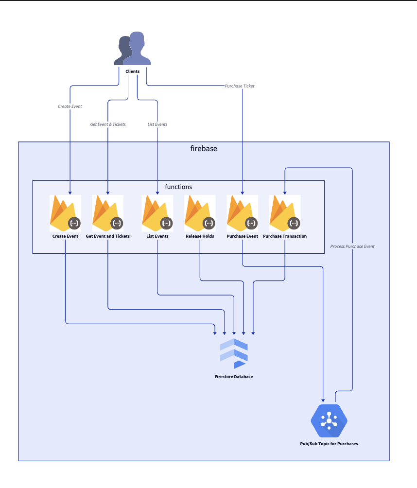
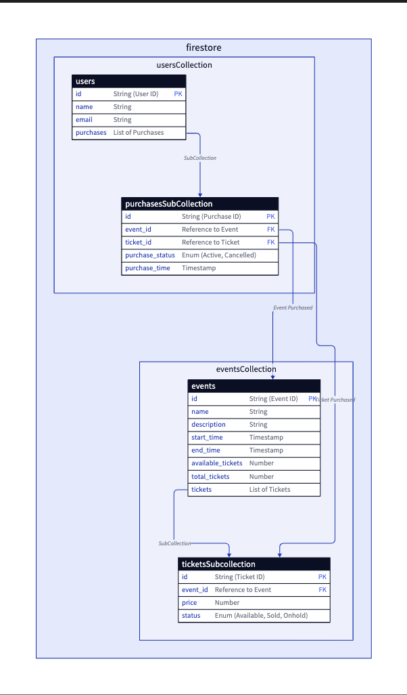

# Architecture Documentation

This directory contains architectural documentation for our project, primarily using D2 diagrams to visualize different aspects of the system.

## Introduction

This documentation is designed to provide a clear understanding of the system’s architecture and data model. The diagrams are rendered using D2, a language specifically for creating diagrams and architecture visualizations. Below you’ll find descriptions and visual representations of the overall system and the data model used in this project.

## Overall System Architecture

The overall system architecture diagram describes the key components and their interactions. This includes the use of Firebase Functions, Firestore collections, Pub/Sub integration for asynchronous event handling, and other core services related to event management and ticket purchasing.

### Overall Architecture Diagram

- Firebase Functions: Handling user requests, ticket purchasing, and scheduled tasks.
- Firestore Collections: Storing data related to events, tickets, and user purchases.
- Pub/Sub: Handling asynchronous communication and events for ticket purchasing and processing.

## Contents

1. `overall-architecture.d2`: A D2 file describing the overall system architecture.
2. `data-model.d2`: A D2 file illustrating the data model and relationships between entities.

## Data Model

The data model diagram shows how the entities like events, tickets, users, and purchases are structured in the system and how they are interrelated. It emphasizes relationships between collections in Firestore, such as how tickets are associated with events, and purchases with users.

### Data Model Diagram

## Usage of D2 Language
D2 is a diagram scripting language that simplifies the process of cre
ating architecture diagrams. By using D2:

- Diagrams are human-readable, text-based, and version-controllable.
- Changes to architecture are easier to track and visualize.
- D2 allows us to define relationships, constraints, and properties between components in a straightforward manner.

D2 files used for this project (overall-architecture.d2 and data-model.d2) are the sources for the visual diagrams, making the architecture documentation both transparent and easily maintainable.
